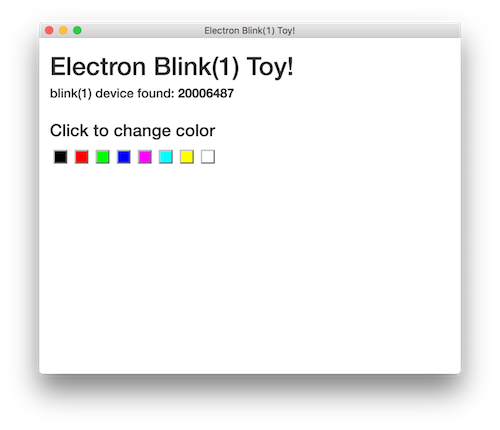

# electron-blink1-toy

A simple Electron app to experiment with `node-blink1` & `node-hid`.

Tested on Electron v8+

Assumes you have blink(1) device plugged in before running app.

To use:
```
npm install
npm run webpack
npm run start
```

To build the application:
```
npm install
npm run webpack
npm run dist
```



#### Note:
On certain OS + Electron version combinations, `node-hid` will need to be
recompiled for Electron, so you will need C compiler installed.  
This is not normally needed for Mac & Windows.

For more details on what you need, see:
* https://github.com/nodejs/node-gyp#installation
* https://github.com/node-hid/node-hid#compiling-from-source

But basically:

* Mac OS X: Install XCode and enable Command Line Tools
* Windows: `npm install -g --production windows-build-tools ; npm install -g node-gyp` (via admin shell)
* Linux: Python, make, gcc (`sudo apt-get install build-essential` on Ubuntu)

#### Previous version:
Uses the magic of `require('babel-register')` in both the app and renderer to do on-the-fly transpiling

This project leans heavily on https://github.com/b52/electron-es6-react
