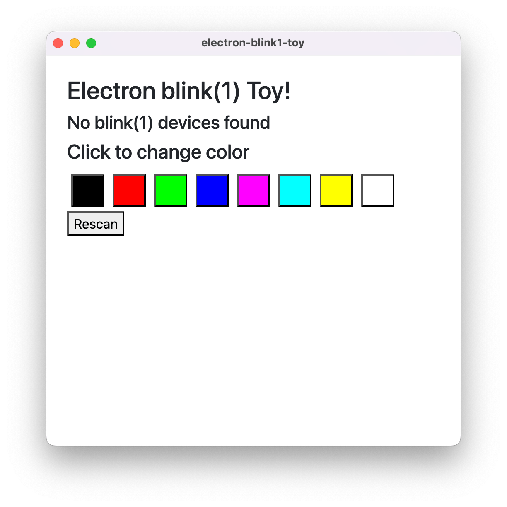

# electron-blink1-toy

A simple Electron app to experiment with `node-blink1` & `node-hid`.

Assumes you have blink(1) device plugged in before running app.

To use:
```
npm install
npm run dev
```

To build the application:
```
npm run build
```

To clean generated files:
```
npm run clean
```



#### Note:
On certain OS + Electron version combinations, `node-hid` will need to be
recompiled for Electron, so you will need C compiler installed.  
This is not normally needed for Mac & Windows.

For more details on what you need, see:
* https://github.com/node-hid/node-hid#compiling-from-source

#### macOS Code Signing & Notarization

To build for macOS with code signing and notarization, set these environment variables:

```bash
export CSC_NAME="Your Name (TEAM_ID)"
export APPLE_ID="your@email.com"
export APPLE_APP_SPECIFIC_PASSWORD="xxxx-xxxx-xxxx-xxxx"
export TEAM_ID="TEAM_ID"
```

Then run:
```
npm run build
```

- `APPLE_APP_SPECIFIC_PASSWORD` must be an [App-Specific Password](https://support.apple.com/en-us/102431) (not your Apple ID password)
- `TEAM_ID` is your Apple Developer Team ID
